  

  ### Freelance Web Designer & Developer | • • Funko Enthusiast | 🎢 Theme Park Geek | 📍 Manchester, UK

  

---

### About Me

Oh Hi There... I'm **Luke**. I love building websites, creating apps and designing lovely stuff. I'm building a freelance self-hosting empire too.

- I’m currently working on **open source projects.**
- I’m currently learning **advanced cloud architecture.**
- I’m looking to collaborate on **self-hosted solutions.**
- Ask me about **tech, design, or the best coffee in Manchester.**
- How to reach me: [hey@lukedunsmore.com](mailto:hey@lukedunsmore.com) - [LukeDunsmore.com](https://www.lukedunsmore.com)

---

### 💻 Tech Stack

| Category | Technologies |
| :--- | :--- |
| **Languages** |      |
| **Frontend** |      |
| **Platforms & CMS** |        |
| **Databases** |     |
| **Design** |    |
| **DevOps & Tools** |       |

---

### 🚀 Recent Projects

| Project | Description | Built With |
| :--- | :--- | :--- |
| **[mediafetch](https://github.com/lukedunsmoto/mediafetch)** | A simple, self-hosted web wrapper for downloading media using yt-dlp. |   |
| **[simplebar-admin-bar-customizer](https://github.com/lukedunsmoto/simplebar-admin-bar-customizer)** | A free, open-source WordPress plugin to easily customize the admin bar and side menu. |   |
| **[html5-component-library](https://github.com/lukedunsmoto/html5-component-library)** | A practical, framework-free HTML component library focused on clarity and accessibility. |   |
| **[copyclean](https://github.com/lukedunsmoto/copyclean)** | Chrome extension to copy selection as plain text. Privacy-first with local storage only. |   |

---

### 📊 GitHub Stats

  

---

  
  
   
   
